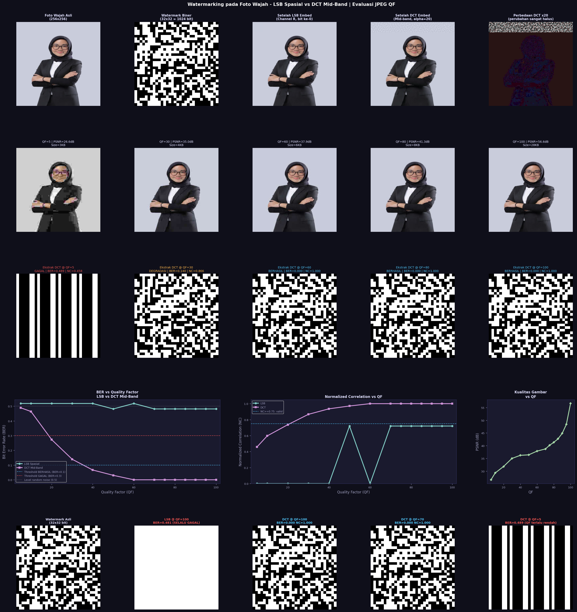

# Digital Image Watermarking


Implementasi digital watermarking pada foto wajah menggunakan dua metode berbasis frekuensi dan spasial, dengan evaluasi ketahanan terhadap kompresi JPEG pada berbagai Quality Factor (QF). Seluruh algoritma ditulis dari scratch tanpa menggunakan fungsi watermarking dari library eksternal.

## Algoritma yang Diimplementasikan

**LSB (Least Significant Bit) — Domain Spasial**

Bit watermark disisipkan ke bit paling rendah (bit ke-0) dari channel merah (R) setiap piksel. Perubahan nilai piksel hanya sebesar ±1 sehingga tidak terlihat secara visual. Metode ini sangat rentan terhadap kompresi JPEG karena proses JPEG itu sendiri berbasis DCT dan quantization yang secara otomatis memodifikasi seluruh nilai piksel termasuk LSB.

**DCT Mid-Band — Domain Frekuensi**

Gambar dikonversi ke ruang warna YCbCr lalu channel luminans (Y) diproses per blok 8×8 menggunakan DCT-II yang diimplementasikan manual via perkalian matriks. Bit watermark diubah ke representasi bipolar (-1 dan +1), dikalikan dengan faktor kekuatan alpha, lalu ditambahkan ke koefisien mid-band (frekuensi menengah) dari setiap blok. Metode ini jauh lebih tahan terhadap kompresi JPEG karena koefisien mid-band dipertahankan oleh JPEG kecuali pada QF yang sangat rendah.

## Cara Install

```bash
git clone https://github.com/SalsabilaShofiyah/watermarking
cd watermarking
pip install numpy pillow matplotlib
```

## Penggunaan

```python
python3 watermarking.py
```

Script akan otomatis melakukan embed watermark ke foto wajah, mengompres dengan 14 nilai QF yang berbeda, mengekstrak watermark dari setiap hasil kompresi, menghitung metrik evaluasi, dan menyimpan semua hasil ke folder `result/`.

## Struktur Repository
watermarking/
├── watermarking.py
├── Foto resmi.JPEG
├── watermarking_evaluation.png
├── foto_watermarked_dct.png
├── foto_watermarked_lsb.png
├── watermark_32x32.png
├── original_face.png
└── README.md

## Implementasi DCT Manual

DCT-II 2D diimplementasikan menggunakan perkalian matriks tanpa scipy atau library transform lainnya:

```python
def _make_dct_matrix():
    N = 8
    D = np.zeros((N, N))
    for u in range(N):
        cu = (1/np.sqrt(2)) if u == 0 else 1.0
        for x in range(N):
            D[u, x] = cu * np.cos(np.pi*(2*x+1)*u/16)
    D *= 0.5
    return D

_D  = _make_dct_matrix()
_DT = _D.T

def dct2_8x8(block):
    return _D @ block.astype(np.float64) @ _DT

def idct2_8x8(dct_block):
    return _DT @ dct_block @ _D
```

Posisi mid-band yang digunakan:

```python
MID_BAND = [(1,2),(2,1),(3,0),(2,3),(1,4),(0,3),(0,5),(1,3)]
```

## Metrik Evaluasi

**BER (Bit Error Rate)** mengukur proporsi bit watermark yang salah setelah diekstrak. Nilai 0.0 berarti sempurna dan nilai 0.5 berarti setara dengan noise acak.

**NC (Normalized Correlation)** mengukur korelasi antara watermark asli dan hasil ekstraksi. Nilai mendekati 1.0 berarti watermark identik.

**PSNR (Peak Signal-to-Noise Ratio)** mengukur kualitas visual gambar setelah kompresi dalam satuan dB.

## Hasil Evaluasi



| QF | BER LSB | Status LSB | BER DCT | Status DCT | PSNR (dB) |
|----|---------|------------|---------|------------|-----------|
| 5  | 0.5186  | GAGAL      | 0.5088  | GAGAL      | 26.59     |
| 10 | 0.5186  | GAGAL      | 0.5010  | GAGAL      | 29.28     |
| 20 | 0.5186  | GAGAL      | 0.2656  | DEGRADASI  | 31.82     |
| 30 | 0.5186  | GAGAL      | 0.1396  | DEGRADASI  | 34.98     |
| 40 | 0.5186  | GAGAL      | 0.0664  | BERHASIL   | 36.21     |
| 50 | 0.4814  | GAGAL      | 0.0303  | BERHASIL   | 36.41     |
| 60 | 0.5186  | GAGAL      | 0.0000  | BERHASIL   | 37.87     |
| 70 | 0.4814  | GAGAL      | 0.0000  | BERHASIL   | 38.72     |
| 75 | 0.4814  | GAGAL      | 0.0000  | BERHASIL   | 40.18     |
| 80 | 0.4814  | GAGAL      | 0.0000  | BERHASIL   | 41.31     |
| 85 | 0.4814  | GAGAL      | 0.0000  | BERHASIL   | 42.69     |
| 90 | 0.4814  | GAGAL      | 0.0000  | BERHASIL   | 44.83     |
| 95 | 0.4814  | GAGAL      | 0.0000  | BERHASIL   | 48.38     |
| 100| 0.4814  | GAGAL      | 0.0000  | BERHASIL   | 56.61     |

## Analisis

LSB selalu gagal di semua QF karena JPEG bekerja via transformasi DCT dan quantization yang memodifikasi seluruh nilai piksel termasuk bit paling rendah. DCT mid-band berhasil diekstrak sempurna mulai QF 60 ke atas, dan masih berhasil dengan degradasi kecil pada QF 40-50. Watermark tidak dapat diekstrak pada QF 10 ke bawah karena quantization terlalu agresif.

**QF kritis: watermark DCT tidak dapat diekstrak pada QF lebih kecil atau sama dengan 10.**

## Referensi

Cox, I., Miller, M., Bloom, J., Fridrich, J., & Kalker, T. (2007). Digital Watermarking and Steganography. Morgan Kaufmann.

ShieldMnt. (2021). invisible-watermark. https://github.com/ShieldMnt/invisible-watermark
