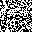

# Tugas Watermarking II2240 Sistem Multimedia

**Nama:** Salsabila Shofiyah  
**NIM:** 18224088  
**Kelas:** K-02  

---

## A. Watermarking

Watermarking adalah teknik menyisipkan informasi tersembunyi ke dalam gambar tanpa mengubah visualnya agar tidak terlihat berbeda dengan gambar aslinya. Tujuannya untuk membuktikan keaslian gambar.

---

## B. Teknik Watermarking yang Digunakan

### 1. Flowchart Cara Kerja Kedua Teknik

<!-- Upload flowchart ke repo lalu ganti path di bawah ini -->


> Keterangan: Flowchart menunjukkan alur kerja metode LSB dan DCT secara paralel, mulai dari resize foto, pembuatan watermark biner, proses embed, kompresi JPEG, ekstraksi, hingga evaluasi metrik BER, NC, dan PSNR.

### 2. Keterangan Cara Kerja Kedua Teknik

| Teknik LSB (Least Significant Bit) | Teknik DCT Mid-Band |
|---|---|
| Menyisipkan watermark dengan mengganti bit terkecil dari nilai piksel (least significant bit), sehingga perubahan warna maksimal hanya ±1 dan tidak terlihat mata. | Menyisipkan watermark ke frekuensi menengah gambar yang stabil saat JPEG diterapkan. Watermark diubah ke nilai bipolar lalu ditambahkan ke koefisien mid-band tiap blok 8×8, dan diekstrak dengan membandingkan selisih koefisien antara gambar asli dan gambar ter-watermark. |

---

## C. Tools dan Library yang Digunakan

- **Python 3** dengan **NumPy** untuk semua operasi array dan komputasi numerik
- **Pillow** sebagai codec JPEG (encode dan decode file)
- **Matplotlib** untuk visualisasi hasil evaluasi

---

## D. Cara Menghitung Quality Factor JPEG

```python
buf = io.BytesIO()
img_pil.save(buf, format='JPEG', quality=QF)
buf.seek(0)
hasil = np.array(Image.open(buf))
```

- Menggunakan buffer memori (BytesIO), tidak disimpan ke disk
- Gambar di-encode ke JPEG dengan QF tertentu, lalu di-decode kembali ke array
- JPEG memiliki parameter QF rentang 1–100. Makin rendah QF, makin besar kompresi
- Pada tugas ini, QF diuji pada 14 nilai: `5 10 20 30 40 50 60 70 75 80 85 90 95 100`

### Metrik Evaluasi

| Metrik | Keterangan | Rumus |
|---|---|---|
| BER (Bit Error Rate) | Proporsi bit yang salah saat ekstraksi. Nilai 0.0 = sempurna, 0.5 = acak | `BER = jumlah bit salah / total bit watermark` |
| NC (Normalized Correlation) | Kemiripan watermark asli vs hasil ekstraksi. Nilai 1.0 = identik | `NC = sum(W × W') / sqrt(sum(W²) × sum(W'²))` |
| PSNR | Kualitas visual gambar setelah kompresi. Makin tinggi makin bagus | `PSNR = 10 × log10(255² / MSE)` |

---

## E. Implementasi Watermarking

**Step 1. Load foto dan buat watermark**

Foto dibuka lalu di-resize ke 256×256 piksel (wajib kelipatan 8 supaya DCT bisa jalan) dan dikonversi ke array NumPy. Watermark dibuat sebagai array acak 32×32 berisi 0 dan 1, dengan seed 42 biar hasilnya selalu sama tiap dijalankan.

| Foto Asli (256×256) | Watermark Biner (32×32) |
|---|---|
|  |  |

---

**Step 2. Embed LSB**

Bit ke-0 channel merah tiap piksel di area 32×32 dihapus pakai logika AND, lalu diisi bit watermark pakai OR.

```python
red = (red & 0b11111110) | (watermark & 1)
```


---

**Step 3. Embed DCT mid-band**

Gambar dikonversi ke YCbCr, lalu channel Y dipotong jadi blok 8×8. Tiap blok di-DCT, bit watermark diubah ke bipolar, dikali alpha 20, lalu ditambahkan ke 8 posisi mid-band. Blok di-IDCT lagi dan gambar dikembalikan ke RGB.


---

**Step 4. Kompresi JPEG**

Kedua gambar ber-watermark dikompres dengan JPEG di setiap nilai QF yang diuji menggunakan BytesIO.

<!-- Upload strip foto kompresi berbagai QF ke repo lalu ganti path di bawah -->


---

**Step 5. Ekstraksi watermark**

Untuk LSB, ambil bit ke-0 channel merah dari gambar hasil kompresi. Untuk DCT, gambar asli dan hasil kompresi di-DCT lagi blok per blok, lalu tanda selisih koefisien mid-band dicek, positif atau negatif.

<!-- Upload strip hasil ekstraksi ke repo lalu ganti path di bawah -->


---

**Step 6. Hitung metrik evaluasi**

Tiga metrik dihitung per nilai QF: BER, NC, dan PSNR.


---

## F. Hasil dan Analisis Quality Factor JPEG

### Output File

| Nama File | Hasil Foto | Keterangan |
|---|---|---|
| `original_face.png` |  | Foto wajah asli setelah di-resize ke 256×256 piksel. |
| `watermark_32x32.png` |  | Pola watermark biner (0 = terang, 1 = gelap), 32×32 piksel. Dibandingkan dengan hasil ekstraksi untuk menghitung BER dan NC. |
| `foto_watermarked_lsb.png` |  | Foto dengan watermark LSB. Secara visual hampir sama persis dengan foto asli karena piksel berubah hanya ±1 bit. |
| `foto_watermarked_dct.png` |  | Foto dengan watermark DCT mid-band. Tidak terlihat jauh berbeda dengan foto aslinya. |
| `watermarking_evaluation.png` |  | Visualisasi proses lengkap: foto asli, pola watermark, perbandingan sebelum/sesudah embed, foto terkompresi berbagai QF, hasil ekstraksi, grafik BER, NC, dan PSNR. |

### Hasil Terminal

```
>>> Evaluasi kompresi JPEG pada 14 nilai QF...
  QF=  5 | BER_LSB=0.5186 | BER_DCT=0.4893 | PSNR=26.59dB | Size=2.8KB
  QF= 10 | BER_LSB=0.5186 | BER_DCT=0.4639 | PSNR=29.28dB | Size=3.3KB
  QF= 20 | BER_LSB=0.5186 | BER_DCT=0.2734 | PSNR=31.82dB | Size=3.9KB
  QF= 30 | BER_LSB=0.5186 | BER_DCT=0.1396 | PSNR=34.98dB | Size=4.5KB
  QF= 40 | BER_LSB=0.5186 | BER_DCT=0.0664 | PSNR=36.21dB | Size=4.9KB
  QF= 50 | BER_LSB=0.4814 | BER_DCT=0.0303 | PSNR=36.41dB | Size=5.3KB
  QF= 60 | BER_LSB=0.5186 | BER_DCT=0.0000 | PSNR=37.87dB | Size=5.8KB
  QF= 70 | BER_LSB=0.4814 | BER_DCT=0.0000 | PSNR=38.72dB | Size=6.5KB
  QF= 75 | BER_LSB=0.4814 | BER_DCT=0.0000 | PSNR=40.18dB | Size=7.0KB
  QF= 80 | BER_LSB=0.4814 | BER_DCT=0.0000 | PSNR=41.31dB | Size=7.6KB
  QF= 85 | BER_LSB=0.4814 | BER_DCT=0.0000 | PSNR=42.69dB | Size=8.6KB
  QF= 90 | BER_LSB=0.4814 | BER_DCT=0.0000 | PSNR=44.83dB | Size=10.3KB
  QF= 95 | BER_LSB=0.4814 | BER_DCT=0.0000 | PSNR=48.38dB | Size=13.7KB
  QF=100 | BER_LSB=0.4814 | BER_DCT=0.0000 | PSNR=56.61dB | Size=28.2KB

========================================================================
                     LAPORAN EVALUASI WATERMARKING
========================================================================
 QF | BER_LSB | Status LSB | BER_DCT | Status DCT |  PSNR
------------------------------------------------------------------------
  5 |  0.5186 |     GAGAL  |  0.4893 |      GAGAL | 26.59
 10 |  0.5186 |     GAGAL  |  0.4639 |      GAGAL | 29.28
 20 |  0.5186 |     GAGAL  |  0.2734 |  DEGRADASI | 31.82
 30 |  0.5186 |     GAGAL  |  0.1396 |  DEGRADASI | 34.98
 40 |  0.5186 |     GAGAL  |  0.0664 |    BERHASIL | 36.21
 50 |  0.4814 |     GAGAL  |  0.0303 |    BERHASIL | 36.41
 60 |  0.5186 |     GAGAL  |  0.0000 |    BERHASIL | 37.87
 70 |  0.4814 |     GAGAL  |  0.0000 |    BERHASIL | 38.72
 75 |  0.4814 |     GAGAL  |  0.0000 |    BERHASIL | 40.18
 80 |  0.4814 |     GAGAL  |  0.0000 |    BERHASIL | 41.31
 85 |  0.4814 |     GAGAL  |  0.0000 |    BERHASIL | 42.69
 90 |  0.4814 |     GAGAL  |  0.0000 |    BERHASIL | 44.83
 95 |  0.4814 |     GAGAL  |  0.0000 |    BERHASIL | 48.38
100 |  0.4814 |     GAGAL  |  0.0000 |    BERHASIL | 56.61
========================================================================

DCT BERHASIL diekstrak (BER<0.1) : QF = [40, 50, 60, 70, 75, 80, 85, 90, 95, 100]
DCT GAGAL diekstrak    (BER>0.3) : QF = [5, 10]
LSB selalu GAGAL karena JPEG merusak LSB via DCT quantization
```

---

## H. Cara Menggunakan Source Code

**1. Install dependencies**
```bash
python3 -m pip install numpy pillow matplotlib
```

**2. Siapkan file**

Letakkan `watermarking.py` dan foto yang ingin di-watermark dalam satu folder yang sama.

**3. Jalankan**
```bash
python3 watermarking.py
```

**4. Tunggu proses selesai**

Hasil foto yang telah di-watermark tersimpan di folder `result/`

---

## I. Kesimpulan

LSB lebih simpel dan cepat, tapi tidak tahan kompresi JPEG sama sekali karena proses DCT dan quantization langsung merusak nilai piksel. DCT jauh lebih tahan karena watermark disisipkan di domain frekuensi. DCT baru gagal saat QF bernilai 10 atau lebih rendah.
